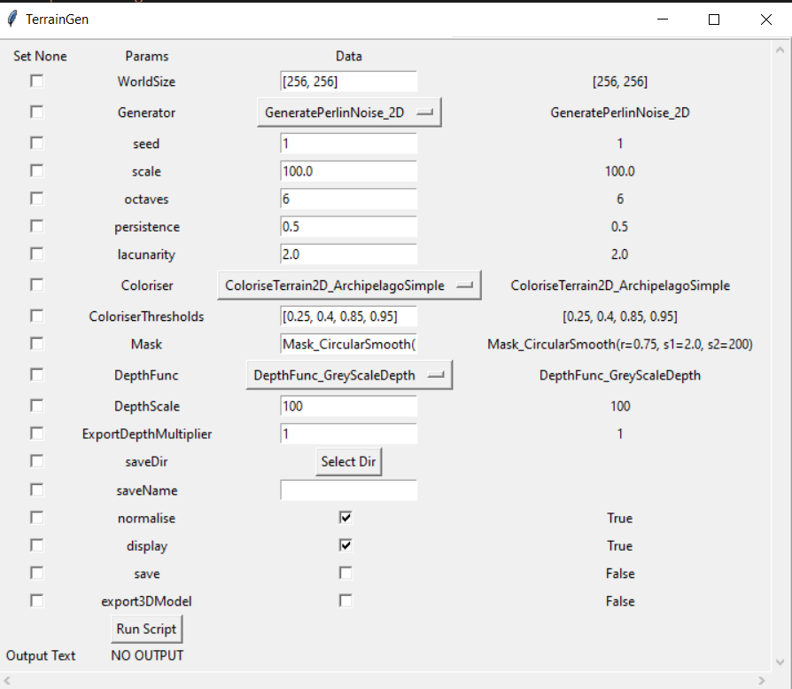
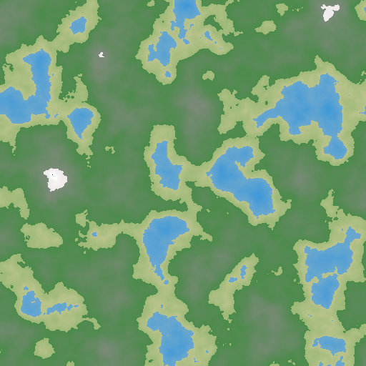
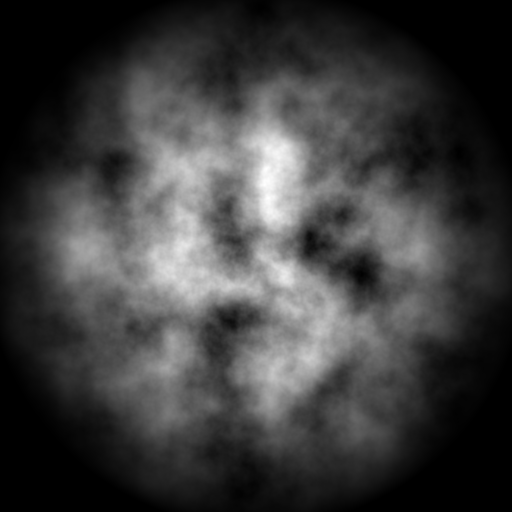
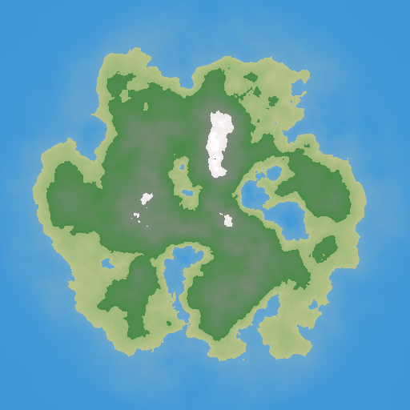
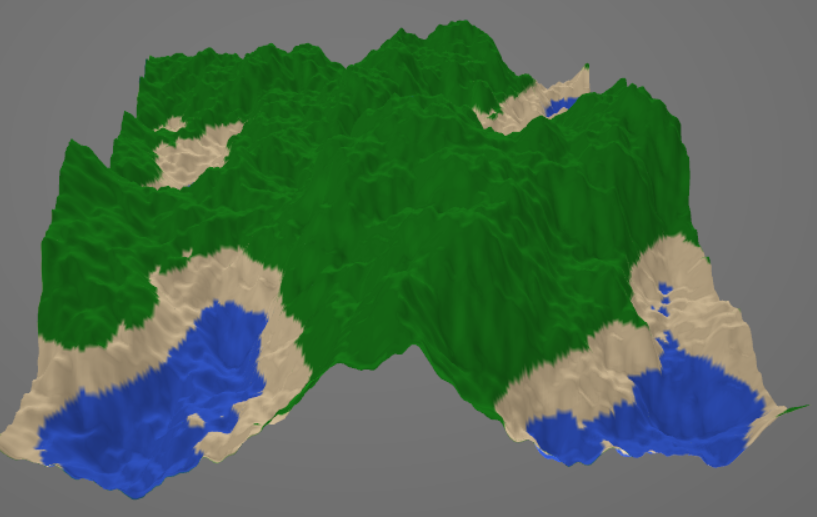

# TerrainGen
 A 2D and 3D realistic Terrain Generator Tool using python

 Hosted at [https://infinityjoker-terrain-gen.herokuapp.com/](https://infinityjoker-terrain-gen.herokuapp.com/)

# GUI

 - GUI Hosted using streamlit
 - Run [StartUI.sh](StartUI.sh) to view the app on your browser!

# TerrainGen UI

 - Generate Terrains using UI easily

    

# Generate 2D Terrains

 - Uses Perlin Noise to generate realistic looking terrain maps

    

 - Form coloured terrains from perlin noise

    

 - Apply Masks to form more specific terrain forms like islands

    

    

# Generate 3D Terrains

 - Generate 3D models from perlin noise terrains and export as OBJ files

 
