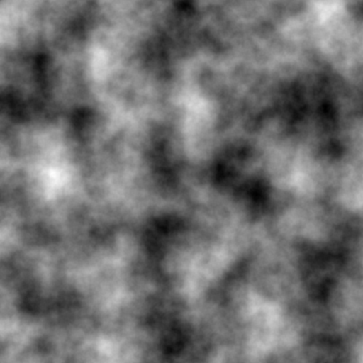

# TerrainGen
 A 2D and 3D realistic Terrain Generator Tool using python

# GUI

 - GUI built using streamlit
 - To use app locally,
    - Clone the repo and run [StartUI.sh](StartUI.sh) to view the app on your browser!
 - App is also hosted remotely on heroku using my common host app,
    - [https://infinityjoker-apps.herokuapp.com/](https://infinityjoker-apps.herokuapp.com/)

    - In the Common Host App, simply choose a project to load and click load and deploy.

    - Then go ahead and use the app! :)

    - If you want to change to another app, simply click on View Other Projects in top left and choose any other project and load and deploy.

# Generate 2D Terrains

 - Uses Perlin Noise to generate realistic looking terrain maps

    

 - Form coloured terrains from perlin noise

    

 - Apply Masks to form more specific terrain forms like islands

    

    

# Generate 3D Terrains

 - Generate 3D models from perlin noise terrains and export as OBJ files

 
